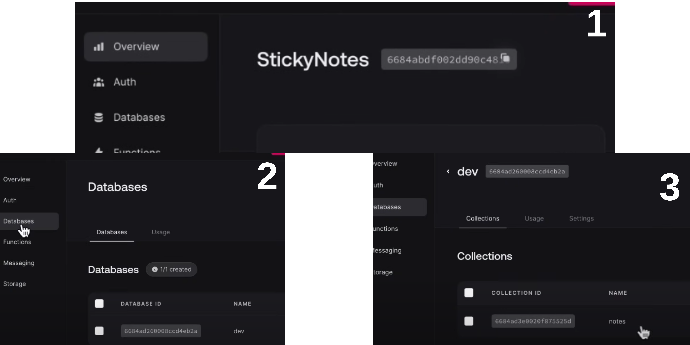

#  Fullstack Note App, React + Appwrite 
# quickly take notes with the sticky note app

##### Your notes will not disappear (until you delete them).Take notes flexibly with the draggable feature.

[live🏄](https://fullstack-note-app.vercel.app/)


* Clone project
* ```npm i```
* ```npm run dev```
* set go to [Appwrite](https://appwrite.io/) and get the keys.

```create project (give a name)> databeses > create a databases(just write the name) > create collection > Create 3 attirubutes (body,colors,position) > add web platform > hostname localhost (maybe vercel later)> get the keys```
